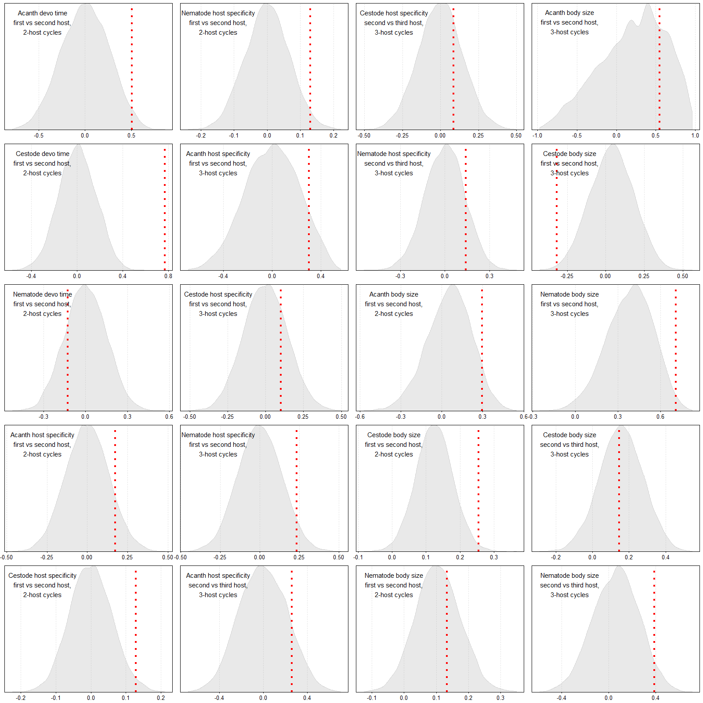

# Decoupled life stages

This script explores how successive stages in parasite life cycles may or may not be decoupled from one another. In other words, are there correlations for traits across the stages of a parasite's life cycle? For example, if a parasite is large as a larva, is it large as an adult too? If a parasite develops slowly as a larva, does it develop slowly as an adult too? From an adaptationist perspective, we expect no correlations, because each stage should be able to adapt somewhat independently to its niche/host. That said, correlations across stages may exist for both adaptive reasons (e.g. a correlation in the quality of intermediate and definitive hosts) and non-adaptive reasons (e.g. developmental constraints). 

