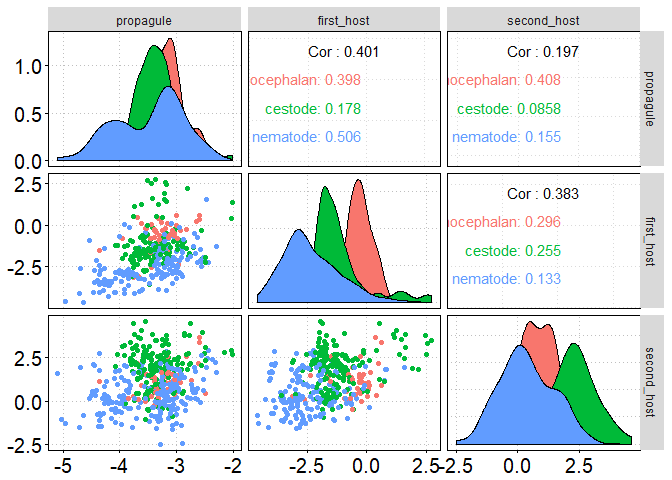
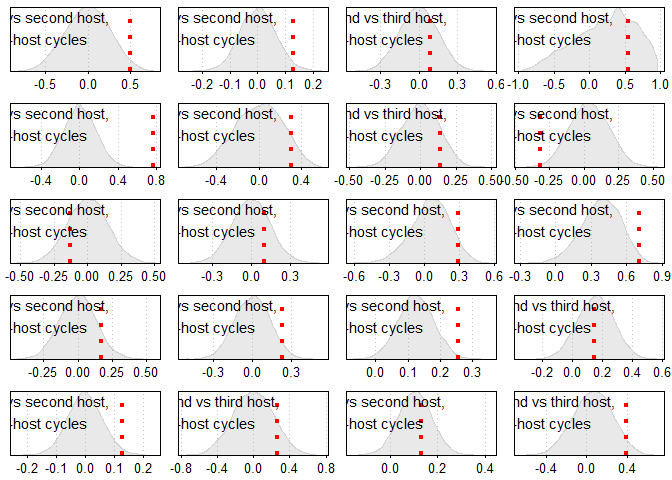

Decoupled life stages
================

This script explores how successive stages in the life cycle of a parasite may or may not be decoupled from one another. In other words, are there correlations for traits across the stages of a parasite's life cycle? For example, if a parasite is large as a larva, is it large as an adult too? If a parasite develops slowly as a larva, does it develop slowly as an adult too? From an adaptationist perspective, we expect no correlations, because each stage should be able to adapt somewhat independently to its niche/host. That said, correlations across stages may exist for both adaptive reasons (e.g. a correlation in the quality of intermediate and definitive hosts) and non-adaptive reasons (e.g. developmental constraints). I explore this using a [database](http://onlinelibrary.wiley.com/doi/10.1002/ecy.1680/suppinfo) of helminth (parasitic worm) life cycles.

Import the data, set plotting theme.

``` r
library(dplyr)
library(ggplot2)
library(tidyr)
library(GGally)

options(stringsAsFactors = FALSE) # never have species lists as factors; always as character vectors

# set theme
theme.o <- theme_update(axis.text = element_text(colour="black", size = 15),
                        axis.title = element_text(colour="black", size = 18, face = "bold", lineheight=0.25),
                        axis.ticks = element_line(colour="black"),
                        panel.border = element_rect(colour = "black",fill=NA),
                        panel.grid.minor=element_blank(),
                        panel.grid.major=element_line(color="gray",linetype = "dotted"),
                        panel.background= element_rect(fill = NA))

# import the life cycle database tables
dataH <- read.csv(file="data/CLC_database_hosts.csv", header = TRUE, sep=",")
dataL <- read.csv(file="data/CLC_database_lifehistory.csv", header = TRUE, sep=",")
```

We start by looking at body size correlations across life stages. On the basis of length, width, and shape, we calculate a body mass for parasites. Also, remove asex species.

``` r
dataL <- mutate(dataL, biovolume = 
                  if_else(Shape %in% c("cylinder", "thread-like", "whip"), 
                          pi * (Width/2)^2 * Length, # calculate volume as a cylinder
                          if_else(Shape %in% c("coiled", "sphere", "ellipsoid"),
                                  4/3 * pi * Length/2 * Width/4, # calculate volume as a ellipsoid
                                  Length * Width # calculate volume as area for remaining ribbon, leaf shapes
                                  )),
                biovolume = biovolume * 1.1) # covert to biomass with assumed 1.1. g/cm3 tissue density
dataL <- filter(dataL, is.na(Asexual)) # remove asexual species
```

We are not explicitly interested in the propagule stage, but we can nonetheless look at how propagule size correlates with body size at other life stages. To do so, we want to select the stage that best reflects initial parasite size.

``` r
# id species that hatch or not
eggos <- filter(dataL, Host.no == 0)%>%
  select(Parasite.species, Egg.hatch)%>%
  mutate(propagule_selector = if_else(Egg.hatch != "eaten", "free larva", "egg"))%>%
  select(-Egg.hatch)%>%
  na.omit%>%distinct()

# determine whether there is a size measurement for embryo or egg stages
eggos2 <- filter(dataL, Host.no == 0)%>%
  select(Parasite.species, Stage, biovolume)%>%
  group_by(Parasite.species, Stage)%>%
  summarize(x = sum(!is.na(biovolume)))

# combine and spread these two tables
eggos2 <- left_join(eggos, eggos2)
eggos2 <- spread(na.omit(eggos2), Stage, x)

# identify the stage where growth starts for each species
eggos2 <- mutate(eggos2, propagule_selector = if_else(propagule_selector == 'free larva', 'free larva',
                                                       if_else(embryo > 0, 'embryo', 'egg')))

# add selector variable to main life history table
eggos2 <- select(eggos2, Parasite.species, propagule_selector)
dataL <- left_join(dataL, eggos2)
rm(eggos, eggos2)

# remove propagule measurements that do not reflect initial size
dataL <- filter(dataL, !(Host.no == 0 & Stage != propagule_selector))
```

Select relevant columns and calculate average body sizes for each species at each stage of the life cycle.

``` r
dataL.sp <- select(dataL, Parasite.species, Host.no, biovolume)%>%
  group_by(Parasite.species, Host.no)%>%
  summarize(biovolume = mean(biovolume, na.rm = T))%>%
  mutate(biovolume = log10(biovolume))
```

Next we make the long data wide, such that parasite body size in the first host, second host, etc. are in the sample row.

``` r
dataL.sp <- spread(dataL.sp, key = Host.no, value = biovolume)
dataL.sp <- rename(dataL.sp, propagule = `0`, first_host = `1`, second_host = `2`,
                   third_host = `3`, fourth_host = `4`, fifth_host = `5`)
```

Add life cycle lengths to the adult sizes.

``` r
maxLCL <- group_by(dataH, Parasite.species)%>%summarize(maxLCL = max(Host.no))
minLCL <- filter(dataH, Facultative == "no")%>%
  group_by(Parasite.species)%>%summarise(minLCL = length(unique(Host.no)))
dataL.sp <- left_join(dataL.sp, maxLCL)
dataL.sp <- left_join(dataL.sp, minLCL)
```

Make life cycle length a nice factor for plotting, and add 'parasite group' back to the table.

``` r
dataL.sp <- mutate( ungroup(dataL.sp), maxLCL.fac = if_else(maxLCL > 3, "4", as.character(maxLCL)))%>%
  mutate(maxLCL.fac = factor(maxLCL.fac, labels = c("1", "2", "3", ">3")))
```

``` r
dataL.sp <- left_join(dataL.sp, select(dataL, Parasite.species, Parasite.group)%>%distinct() )
```

Now the data is suitable for looking at body size correlations. We look separately each life cycle length (1-host, 2-host, etc). First, there is not much of a correlation between propagule and adult size in simple life cycle parasites.

``` r
cor( filter(dataL.sp, maxLCL == 1)%>%select(propagule:first_host), use = "pairwise.complete.obs")
```

    ##            propagule first_host
    ## propagule  1.0000000  0.1124722
    ## first_host 0.1124722  1.0000000

For the 2-host complex life cycle parasites, we plot the correlation matrix. They are all positive. Overall, the correlation coefficients between consecutive stages are ~ 0.4. They tend to be lower within helminth groups, though still positive.

``` r
ggpairs(filter(dataL.sp, maxLCL == 2), columns = c("propagule", "first_host", "second_host"),
        mapping = aes(color = Parasite.group))
```



Make the same plot for 3-host parasites. Again, the correlations are mostly positive, though there is more variation. Especially the cestodes seem to buck the pattern, with size in the first and second host being negatively correlated. There are too few species with long cycles (&gt; 3 hosts) and body sizes to produce a similar plot.

``` r
ggpairs(filter(dataL.sp, maxLCL == 3), columns = c("propagule", "first_host", "second_host", "third_host"),
        mapping = aes(color = Parasite.group))
```


The data support the idea that there are weak correlations between body sizes at consecutive life stages. This is expected to some degree, because big larvae will not be tiny adults, unless the all other worms grow extensively as adults. Below, I used a permutation to try to deal with 'built-in' correlation.

Let's move on to the next trait: development time. First, wrangle the data in a similar way to body size. We focus on degree days as the measure of development time, given that development is usually a function of temperature.

``` r
# calculate degree days, get species averages
datadt <- mutate(dataL, dd = Development.time * (Temp - 5))%>%
  select(Parasite.species, Host.no, dd)%>%
  group_by(Parasite.species, Host.no)%>%
  summarize(dd = mean(dd, na.rm = T))%>%
  mutate(dd = log10(dd))

# make long data wide, relabel columns
datadt <- spread(datadt, key = Host.no, value = dd)
datadt <- rename(datadt, propagule = `0`, first_host = `1`, second_host = `2`,
                   third_host = `3`, fourth_host = `4`, fifth_host = `5`)

# add life cycle lengths and parasite group
datadt <- left_join(datadt, maxLCL)
datadt <- left_join(datadt, minLCL)
datadt <- left_join(datadt, select(dataL, Parasite.species, Parasite.group)%>%distinct() )

# make nice factor for life cycle length for plotting
datadt <- mutate( ungroup(datadt), maxLCL.fac = if_else(maxLCL > 3, "4", as.character(maxLCL)))%>%
  mutate(maxLCL.fac = factor(maxLCL.fac, labels = c("1", "2", "3", ">3")))
```

For simple cycles, the correlation between propagule development rate and development rate in the first host is mildly positive.

``` r
cor( filter(datadt, maxLCL == 1)%>%select(propagule:first_host), use = "pairwise.complete.obs")
```

    ##            propagule first_host
    ## propagule  1.0000000  0.2381676
    ## first_host 0.2381676  1.0000000

We can again plot a correlation matrix for worm with 2-host cycles. Most of these species do not develop in the propagule stage (i.e. while free in the environment, they do not embryonate or develop before hatching). The correlation of development times in the first and second hosts are positive for acanths and cestodes, but slightly negative for nematodes. This implies that long larval development is associated with long adult development, which is somewhat surprising, as it is not consistent with expected tradeoffs.

``` r
ggpairs(filter(datadt, maxLCL == 2), columns = c("propagule", "first_host", "second_host"),
        mapping = aes(color = Parasite.group))
```


The same plot for 3-host parasites is very sparse, so there is not much that can be concluded from it. Still, the combination with the most points (first vs second host) exhibits positive correlations.

``` r
ggpairs(filter(datadt, maxLCL == 3), columns = c("propagule", "first_host", "second_host", "third_host"),
        mapping = aes(color = Parasite.group))
```


Let's look at the third trait: host specificity. Is host specificity at consecutive life stages correlated? We again wrangle the data into a usable format. We are using output from this [script](GITHUB), in which a host specificity index is calculated that accounts for the taxonomic similarity of hosts.

``` r
# import from host specificity analyses project
datahs <- read.csv(file="data/hs_growth_out.csv", header = TRUE, sep=",")

# select relevant columns (already species avgs) and spread the data
datahs <- select(datahs, Parasite.species, Host.no, hs)%>%
  spread(key = Host.no, value = hs)%>%
  rename(first_host = `1`, second_host = `2`, third_host = `3`, fourth_host = `4`, fifth_host = `5`)

# add life cycle lengths and parasite group
datahs <- left_join(datahs, maxLCL)
datahs <- left_join(datahs, minLCL)
datahs <- left_join(datahs, select(dataL, Parasite.species, Parasite.group)%>%distinct() )

# make nice factor for life cycle length for plotting
datahs <- mutate( datahs, maxLCL.fac = if_else(maxLCL > 3, "4", as.character(maxLCL)))%>%
  mutate(maxLCL.fac = factor(maxLCL.fac, labels = c("1", "2", "3", ">3")))
```

Produce the correlation matrix for two-host cycles. The distribution of the host specificity index is more right-skewed than the previous variables. That is not too surprising. Many parasites have only been recorded for one or two hosts at a given life stage. The correlations across stages are positive, but low.

``` r
ggpairs(filter(datahs, maxLCL == 2), columns = c("first_host", "second_host"),
        mapping = aes(color = Parasite.group))
```


We make the same figure for three-host cycles, and again find positive, but low correlations.

``` r
ggpairs(filter(datahs, maxLCL == 3), columns = c("first_host", "second_host", "third_host"),
        mapping = aes(color = Parasite.group))
```


Now, we have looked at a lot of correlations, and they tend to be positive. But they also vary in sample sizes, distributions, expected correlations (e.g. expected to be positive for growth). To get more of an overview, let's get the sample size, the observed correlation, the expected correlation, and a plot showing the observed value compared to the expected distribution. For this, we make a function that we can use for different subsets of the data (filtered by life cycle length and parasite group).

``` r
decouple <- function(data, lcl, pg, host1, host2){
  # this function takes in a data table and filtering criteria
  # it returns a list related to the specified cross-stage correlation
  
  # if development time data, then trait is dt, if it is host specificity table, then hs
  if(identical(data, datadt)) {
    trait <- "Devo time"} else if(identical(data, datahs)) {
      trait <- "Host specificity"
    }
  
  # filter data
  test <- filter(data, maxLCL == lcl, Parasite.group == pg)%>%
    select(host1, host2)%>%
    na.omit()
  
  # calculate observed correlation
  obs <- cor(test[[host1]], test[[host2]])
  
  # permutation to get random expectations
  r_vec <- numeric()
  for(i in 1:9999){
    y <- sample(test[[host2]], length( test[[host2]] ), replace = F)
    r <- cor( test[[host1]], y)
    r_vec <- c(r_vec, r)
  }
  
  # median from permutations
  expected <- median(r_vec)
  
  # permutation p-val
  test_stat <- obs - expected # calculate test statistic
  r_vec0 <- abs(r_vec - expected) # center permutations, make all positive to calc 2-sided p-value
  p_val <- sum( r_vec0 >= abs(test_stat) ) / ( length(r_vec0) + 1 ) # how many permutations greater than observed?
  
  # plot results
  out_plot <- ggplot(data.frame(r_vec), aes(x = r_vec)) + 
    geom_density(colour = "lightgray", fill = "darkgray", alpha = 0.25) +
    geom_vline(aes(xintercept = obs), color = 'red', linetype = 'dotted', size = 1.5) +
    scale_y_continuous(expand = c(0,0)) +
    theme(axis.title = element_blank(),
          axis.text.y = element_blank(),
          axis.text.x = element_text(size = 10),
          axis.ticks.y = element_blank(),
          panel.grid.major.y = element_blank())
  
  rangex <- max(ggplot_build(out_plot)$data[[1]]$x) - min(ggplot_build(out_plot)$data[[1]]$x)
  rangey <- max(ggplot_build(out_plot)$data[[1]]$y) - min(ggplot_build(out_plot)$data[[1]]$y)
  
  if(pg == 'acanthocephalan'){
    pg_l <- 'Acanth'
  } else if(pg == 'cestode'){
    pg_l <- 'Cestode'
  } else {
    pg_l <- 'Nematode'
  }
  
  out_plot <- out_plot + # add label
    annotate("text",
             size = 4,
             # put at 15% of the range along x-axis
             x = min(ggplot_build(out_plot)$data[[1]]$x) + rangex * 0.2,
             # put at 75% of the range along y-axis
             y = min(ggplot_build(out_plot)$data[[1]]$y) + rangey * 0.85,
             # add label based on group used
             label = paste(pg_l, " ", tolower(trait), "\n",
                           gsub("_host", "", host1), " vs ", gsub("_", " ", host2), ",\n",
                           lcl, "-host cycles",
                           sep = ""))
  
  # put results in a list
  results <- list(trait = trait, pg = pg, lcl = lcl, n = length(y),
                  obs = obs, expected = expected, p_val = p_val, out_plot = out_plot)
  return(results)
}
```

Then we use this function for all combinations of trait, life cycle length, and parasite taxa.

``` r
# developmental time cross-stage correlations
dt_out1 <- decouple(data = datadt, lcl = 2, pg = 'acanthocephalan', 'first_host', 'second_host')
dt_out2 <- decouple(data = datadt, lcl = 2, pg = 'cestode', 'first_host', 'second_host')
dt_out3 <- decouple(data = datadt, lcl = 2, pg = 'nematode', 'first_host', 'second_host')
dt_out4 <- decouple(data = datadt, lcl = 3, pg = 'acanthocephalan', 'first_host', 'second_host')
dt_out5 <- decouple(data = datadt, lcl = 3, pg = 'cestode', 'first_host', 'second_host')
dt_out6 <- decouple(data = datadt, lcl = 3, pg = 'nematode', 'first_host', 'second_host')
dt_out7 <- decouple(data = datadt, lcl = 3, pg = 'acanthocephalan', 'second_host', 'third_host')
dt_out8 <- decouple(data = datadt, lcl = 3, pg = 'cestode', 'second_host', 'third_host')
dt_out9 <- decouple(data = datadt, lcl = 3, pg = 'nematode', 'second_host', 'third_host')
# throws errors, as some combos are empty
```

``` r
# host specificity cross stage correlations
hs_out1 <- decouple(data = datahs, lcl = 2, pg = 'acanthocephalan', 'first_host', 'second_host')
hs_out2 <- decouple(data = datahs, lcl = 2, pg = 'cestode', 'first_host', 'second_host')
hs_out3 <- decouple(data = datahs, lcl = 2, pg = 'nematode', 'first_host', 'second_host')
hs_out4 <- decouple(data = datahs, lcl = 3, pg = 'acanthocephalan', 'first_host', 'second_host')
hs_out5 <- decouple(data = datahs, lcl = 3, pg = 'cestode', 'first_host', 'second_host')
hs_out6 <- decouple(data = datahs, lcl = 3, pg = 'nematode', 'first_host', 'second_host')
hs_out7 <- decouple(data = datahs, lcl = 3, pg = 'acanthocephalan', 'second_host', 'third_host')
hs_out8 <- decouple(data = datahs, lcl = 3, pg = 'cestode', 'second_host', 'third_host')
hs_out9 <- decouple(data = datahs, lcl = 3, pg = 'nematode', 'second_host', 'third_host')
```

We need to update this `decouple` function for comparing body size. Instead of randomly combining size in host 1 and host 2 to get a random expected distribution of correlations, we sample growth amounts by worms. We add this random amount of growth to the parasite size in the previous host. Thus, we are asking are the correlations more positive than expected.

``` r
# test values
# data <- dataL.sp
# pg <- "acanthocephalan"
# lcl <- 2
# host1 <- "first_host"
# host2 <- "second_host"

decouple_size <- function(data, lcl, pg, host1, host2){
  # this function takes in a data table and filtering criteria
  # it returns a list related to the specified cross-stage correlation
  
  # only for body size, because it randomly adds growth to size in previous host
  trait <- "Body size"
  
  # filter data
  test <- filter(data, maxLCL == lcl, Parasite.group == pg)%>%
    select(host1, host2)%>%
    na.omit()
  
  # calculate observed correlation
  obs <- cor(test[[host1]], test[[host2]])
  
  # permutation to get random expectations
  # first need to get random expected growth, so calculate absolute growth between consecutive stages
  growth <- 10^test[[host2]] - 10^test[[host1]]
  # then permute taking random growth and adding it to size in lower level host
  r_vec <- numeric()
  for(i in 1:9999){
    grew <- sample( growth, length(growth), replace = F) # rand sample of growth amounts
    y <- 10^test[[host1]] + grew # add growth to size in host1, can result in negatives 
    y <- log10(y) # re-transform
    
    r <- cor( test[[host1]], y, use = 'complete.obs')
    r_vec <- c(r_vec, r)
  }
  
  # median from permutations
  expected <- median(r_vec)
  
  # permutation p-val
  test_stat <- obs - expected # calculate test statistic
  r_vec0 <- abs(r_vec - expected) # center permutations, make all positive to calc 2-sided p-value
  p_val <- sum( r_vec0 >= abs(test_stat) ) / ( length(r_vec0) + 1 ) # how many permutations greater than observed?
  
  # plot results
  out_plot <- ggplot(data.frame(r_vec), aes(x = r_vec)) + 
    geom_density(colour = "lightgray", fill = "darkgray", alpha = 0.25) +
    geom_vline(aes(xintercept = obs), color = 'red', linetype = 'dotted', size = 1.5) +
    scale_y_continuous(expand = c(0,0)) +
    theme(axis.title = element_blank(),
          axis.text.y = element_blank(),
          axis.text.x = element_text(size = 10),
          axis.ticks.y = element_blank(),
          panel.grid.major.y = element_blank())
  
  rangex <- max(ggplot_build(out_plot)$data[[1]]$x) - min(ggplot_build(out_plot)$data[[1]]$x)
  rangey <- max(ggplot_build(out_plot)$data[[1]]$y) - min(ggplot_build(out_plot)$data[[1]]$y)
  
  if(pg == 'acanthocephalan'){
    pg_l <- 'Acanth'
  } else if(pg == 'cestode'){
    pg_l <- 'Cestode'
  } else {
    pg_l <- 'Nematode'
  }
  
  out_plot <- out_plot + # add label
    annotate("text",
             size = 4,
             # put at 15% of the range along x-axis
             x = min(ggplot_build(out_plot)$data[[1]]$x) + rangex * 0.2,
             # put at 75% of the range along y-axis
             y = min(ggplot_build(out_plot)$data[[1]]$y) + rangey * 0.85,
             # add label based on group used
             label = paste(pg_l, " ", tolower(trait), "\n",
                           gsub("_host", "", host1), " vs ", gsub("_", " ", host2), ",\n",
                           lcl, "-host cycles",
                           sep = ""))
  
  # put results in a list
  results <- list(trait = trait, pg = pg, lcl = lcl, n = length(y),
                  obs = obs, expected = expected, p_val = p_val, out_plot = out_plot)
  return(results)
}
```

``` r
bs_out1 <- decouple_size(data = dataL.sp, lcl = 2, pg = 'acanthocephalan', 'first_host', 'second_host')
bs_out2 <- decouple_size(data = dataL.sp, lcl = 2, pg = 'cestode', 'first_host', 'second_host')
bs_out3 <- decouple_size(data = dataL.sp, lcl = 2, pg = 'nematode', 'first_host', 'second_host')
bs_out4 <- decouple_size(data = dataL.sp, lcl = 3, pg = 'acanthocephalan', 'first_host', 'second_host')
bs_out5 <- decouple_size(data = dataL.sp, lcl = 3, pg = 'cestode', 'first_host', 'second_host')
bs_out6 <- decouple_size(data = dataL.sp, lcl = 3, pg = 'nematode', 'first_host', 'second_host')
bs_out7 <- decouple_size(data = dataL.sp, lcl = 3, pg = 'acanthocephalan', 'second_host', 'third_host')
bs_out8 <- decouple_size(data = dataL.sp, lcl = 3, pg = 'cestode', 'second_host', 'third_host')
bs_out9 <- decouple_size(data = dataL.sp, lcl = 3, pg = 'nematode', 'second_host', 'third_host')
# throws errors, as log transform of negative values not possible
```

We combine info from all these correlations into a dataframe. In some cases, sample sizes are obviously too low to be informative.

``` r
decoupled <- bind_rows(data.frame(dt_out1[1:7]),
                       data.frame(dt_out2[1:7]),
                       data.frame(dt_out3[1:7]),
                       data.frame(dt_out4[1:7]),
                       data.frame(dt_out5[1:7]),
                       data.frame(dt_out6[1:7]),
                       data.frame(dt_out7[1:7]),
                       data.frame(dt_out8[1:7]),
                       data.frame(dt_out9[1:7]),
                       data.frame(hs_out1[1:7]),
                       data.frame(hs_out2[1:7]),
                       data.frame(hs_out3[1:7]),
                       data.frame(hs_out4[1:7]),
                       data.frame(hs_out5[1:7]),
                       data.frame(hs_out6[1:7]),
                       data.frame(hs_out7[1:7]),
                       data.frame(hs_out8[1:7]),
                       data.frame(hs_out9[1:7]),
                       data.frame(bs_out1[1:7]),
                       data.frame(bs_out2[1:7]),
                       data.frame(bs_out3[1:7]),
                       data.frame(bs_out4[1:7]),
                       data.frame(bs_out5[1:7]),
                       data.frame(bs_out6[1:7]),
                       data.frame(bs_out7[1:7]),
                       data.frame(bs_out8[1:7]),
                       data.frame(bs_out9[1:7])
                       )
decoupled
```

    ##               trait              pg lcl   n         obs      expected
    ## 1         Devo time acanthocephalan   2  16  0.50446016  0.0030282271
    ## 2         Devo time         cestode   2  39  0.76943392 -0.0003807470
    ## 3         Devo time        nematode   2  47 -0.12638948  0.0012762554
    ## 4         Devo time acanthocephalan   3   1          NA            NA
    ## 5         Devo time         cestode   3   8 -0.49629385  0.0444478918
    ## 6         Devo time        nematode   3   2 -1.00000000  1.0000000000
    ## 7         Devo time acanthocephalan   3   0          NA            NA
    ## 8         Devo time         cestode   3   2 -1.00000000 -1.0000000000
    ## 9         Devo time        nematode   3   0          NA            NA
    ## 10 Host specificity acanthocephalan   2  58  0.17281693 -0.0003150558
    ## 11 Host specificity         cestode   2 279  0.12836072 -0.0009213763
    ## 12 Host specificity        nematode   2 236  0.12968419 -0.0016020803
    ## 13 Host specificity acanthocephalan   3  22  0.30368535  0.0055892296
    ## 14 Host specificity         cestode   3  49  0.10196941 -0.0013632968
    ## 15 Host specificity        nematode   3  54  0.23257333  0.0017573512
    ## 16 Host specificity acanthocephalan   3  22  0.26154271  0.0012411040
    ## 17 Host specificity         cestode   3  49  0.08641958 -0.0023422461
    ## 18 Host specificity        nematode   3  57  0.14167163  0.0044601662
    ## 19        Body size acanthocephalan   2  41  0.29623153  0.0632109961
    ## 20        Body size         cestode   2 184  0.25494247  0.1235933290
    ## 21        Body size        nematode   2 152  0.13297407  0.1061441055
    ## 22        Body size acanthocephalan   3   7  0.54996430  0.2580400057
    ## 23        Body size         cestode   3  35 -0.31844540  0.0380656160
    ## 24        Body size        nematode   3  23  0.70715141  0.3900226808
    ## 25        Body size acanthocephalan   3  11  0.31890684  0.1335807653
    ## 26        Body size         cestode   3  46  0.14665414  0.1559402527
    ## 27        Body size        nematode   3  25  0.38993006  0.0627981215
    ##     p_val
    ## 1  0.0481
    ## 2  0.0000
    ## 3  0.3992
    ## 4      NA
    ## 5  0.1657
    ## 6  0.4947
    ## 7      NA
    ## 8  0.9999
    ## 9      NA
    ## 10 0.1910
    ## 11 0.0287
    ## 12 0.0438
    ## 13 0.1824
    ## 14 0.4850
    ## 15 0.1000
    ## 16 0.2430
    ## 17 0.5453
    ## 18 0.3079
    ## 19 0.1480
    ## 20 0.0165
    ## 21 0.6955
    ## 22 0.5276
    ## 23 0.0081
    ## 24 0.0487
    ## 25 0.5193
    ## 26 0.9415
    ## 27 0.0926

Let's arbitrarily restrict ourselves to correlations with at least 10 species.

``` r
decoupled <- filter(decoupled, n > 10)
```

That leaves 20 correlations. Of these, 7 are significant according to our two-sided permutation test, or 35 percent.

In most cases, the correlations are more positive than we expected based on random permutations. In 85 percent of cases, the observed correlation coefficient was larger than the random expectation. We can also visualize how the observed correlations differed from expectations. For all 20 correlations, we plot the expected distribution, based on the permutations, and indicate the observed value with a red line. In most cases, the observed value is falling on the right-hand side of the distribution, i.e. the correlation is more positive than expected.

``` r
source("src/multiplot.R")
multiplot(dt_out1$out_plot, dt_out2$out_plot, dt_out3$out_plot, hs_out1$out_plot,
          hs_out2$out_plot, hs_out3$out_plot, hs_out4$out_plot, hs_out5$out_plot,
          hs_out6$out_plot, hs_out7$out_plot, hs_out8$out_plot, hs_out9$out_plot,
          bs_out1$out_plot, bs_out2$out_plot, bs_out3$out_plot, bs_out4$out_plot,
          bs_out5$out_plot, bs_out6$out_plot, bs_out8$out_plot, bs_out9$out_plot,
          cols = 4)
```



``` r
# exported at 1600 x 1600 px
```

(Note: getting the text size for annotations correct in the figure is challenging and would take some more trial and error)
